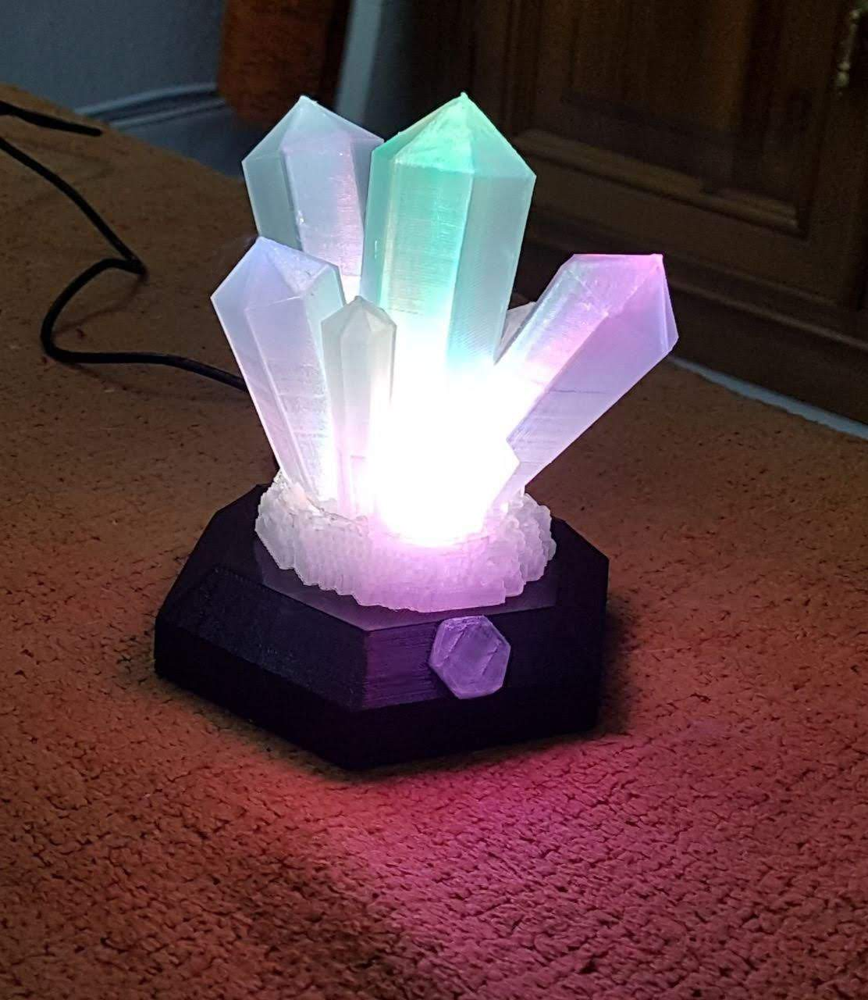
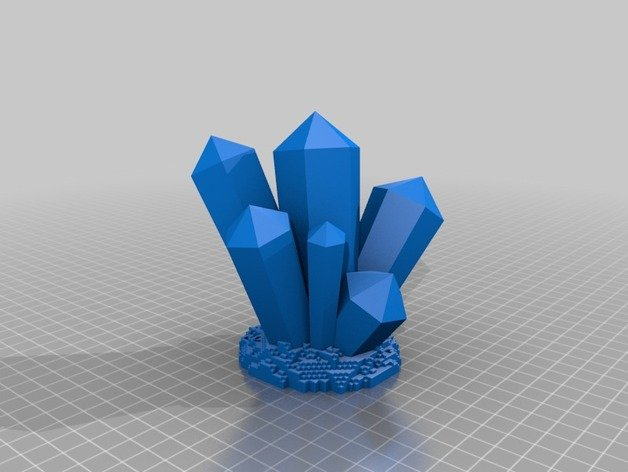
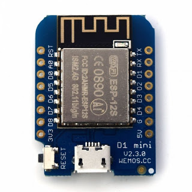
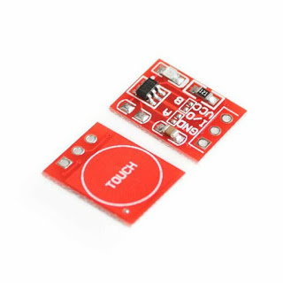
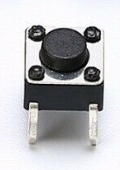

# syncrolights

This project consists on a system of decorative lights that changes color by pressing a button, but syncronyzed through internet with their "partners". So, when the color of one of them is changed, the others mimics this change.

[YouTube](https://youtu.be/mCSxQj67VzU)

# Synchronization method
For mantaning the syncronization without NAT problems, it is needed to have a central server in "the cloud". For avoiding the need of creating a server there is the alternative of using an existing public service like Telegram. I choosen to use the old IRC protocol. 

The strategy consists on that all the lights that are in the same group will keep connected to the same IRC channel. When one user changed the color, the device will send a "topic" change to the IRC channel. This way the IRC sever will notify the topic change to all the other clients that has joint this channel and then will change the color.

# Plastic parts
The case for this project consists on two parts. One of them is a simulation of crystals that I've found at thingiverse:

(https://www.thingiverse.com/thing:1330791)

This crylsals will be 3D printed with tarnspartent PLA wich will result in a translulcid material and the layers will difuse the light with a prety result.

The base is printed with black PLA. I've uploaded the model to thingiverse

(https://www.thingiverse.com/thing:3537644)

# The electronics
For this function we will use a WEMOS D1 Mini module which consists on an ESP8266 processor with an USB-SRIAL CH340; they are very cehap (about $3). The color lights will be RGB LEDs driven by transistors for allowing to connect various of them without overloading the ESP9266 GPIO aoutputs. The power will be provided driectly from USB using a phone charger connected to the micro-USB port of the board.

(https://www.aliexpress.com/item/D1-mini-Mini-NodeMcu-4M-bytes-Lua-WIFI-Internet-of-Things-development-board-based-ESP8266-by/32651747570.html)

For choosing the color, wee need a pushbutton. In the prototype I used a common one connected from pin D3 to GND but in the final version I decded to use some more "geek". I've found the TTP223 caacitive modules at 10 for $1,24, then I decided to include one. NOTE: for simulating the active-low effect you must solder the jumper A on the board

https://www.ebay.com/itm/10X-TTP223-Touch-Key-Module-Capacitive-Settable-Self-lock-No-lock-Switch-Board/332931518377

Nevertheless, I've used a pushbutton that can be accessed through a small hole in the down side that will be used to enter configuration mode.

(to be continued)
